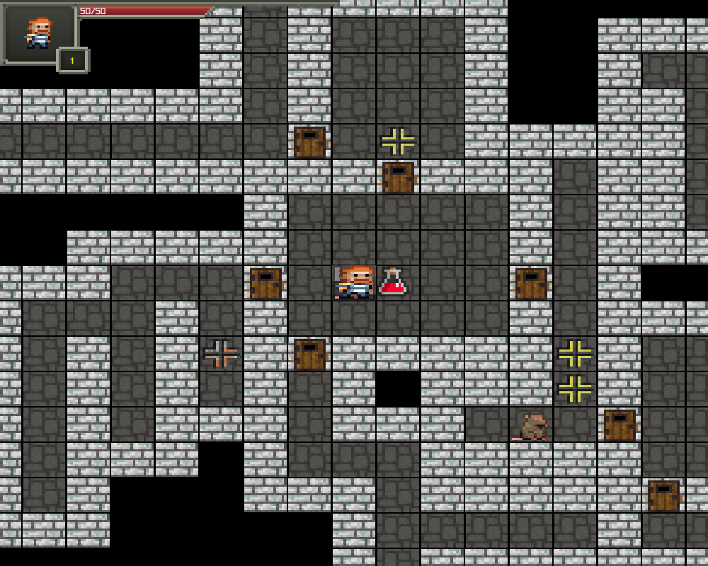
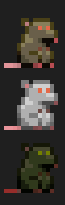
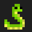
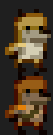

# Dungeon Final Demo - 第15組
## 遊戲展示畫面

## 角色基本控制說明
### WASD: 上下左右
### Space: 攻擊 / 使用items
### Ctrl + s: 儲存
### Ctrl + l:加載
### Ctrl + up: 音量調大
### Ctrl + down: 音量調小

## 物件說明
### 傷害陷阱:直接扣血

### 流血陷阱: 給流血Buff

### 恢復藥水: 恢復血量到滿

### 力量藥水:最大傷害/最小傷害都+1

## 怪物物件說明
### 老鼠:小怪

### 蛇:閃避值很高攻擊時有機率無傷害

### 狐狸人:素質強一點的小怪

### 螃蟹:一回合可以移動兩格

## 移動物件說明
### 出口

### 往上層通道

### 往下層通道

